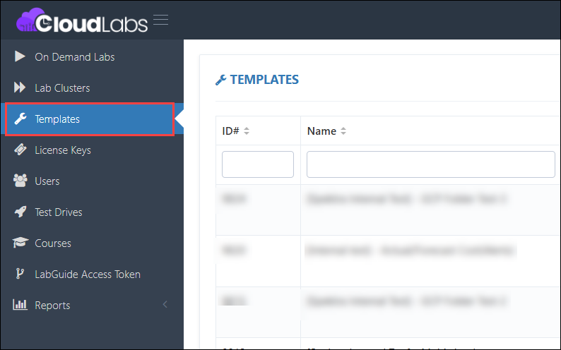
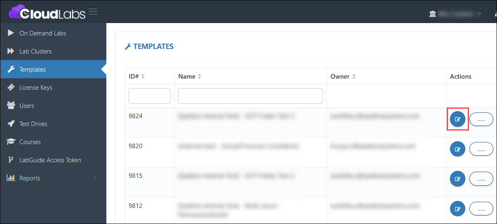
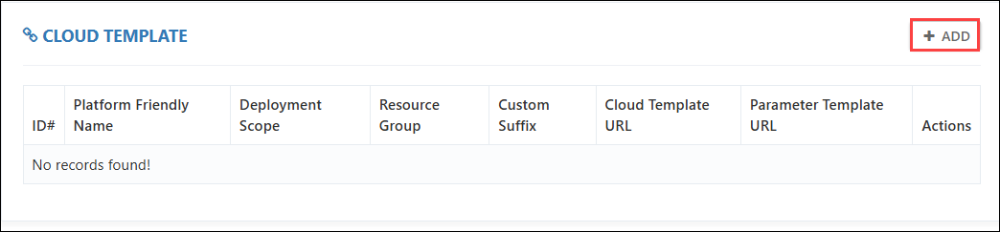
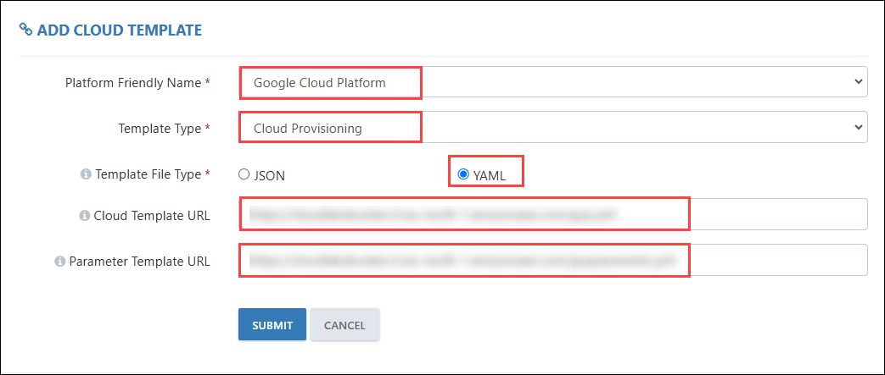
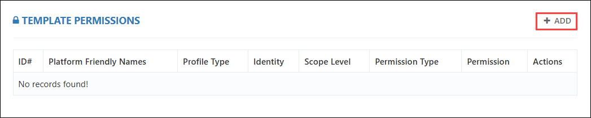
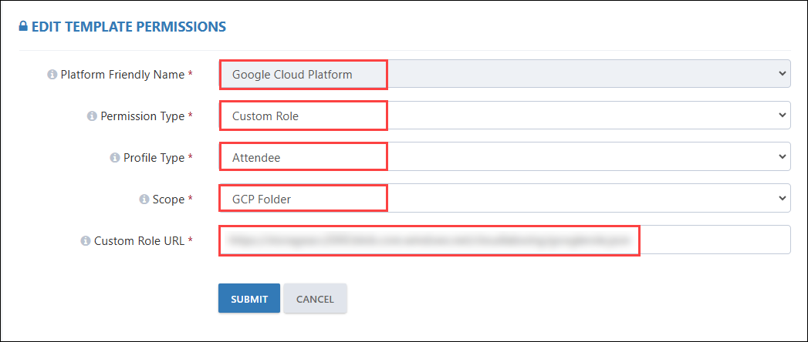

## User Assignment with Folder and Project Access (Release Date: )  

### Feature Requirement: 

A dedicated folder with four associated projects must be assigned for each users, with resource deployments restricted to the first project(Admin project) when using a Deployment Manager. Basic and custom roles should be configured to meet specific access requirements.

### Implementation: 

- A new access control mechanism was introduced to ensure each user receives a designated folder with four projects.  
- The deployment of resources was configured to always occur in the first project.  
- Permissions can be structured at the folder level to ensure consistent access across all associated projects.

### Steps to Perform on the Template:  

1. Log in to the **CL Portal**, navigate to the required tenant (**WIZ**), and go to the **Template** section on the left-hand side.
   
   
   
2. Click on **Edit** for the template where you want to configure deployment and access settings.

   
   
3. Navigate to the **Cloud Template** section, click on **+ADD**, and upload the required file to automate resource deployment.

    
 
4. Choose the configurations as specified below, then click **Submit**:  
   - **Platform Friendly Name**: *Google Cloud Platform*  
   - **Template Type**: *Cloud Provisioning*  
   - **Template File Type**: *JSON / YAML*  
   - **Cloud Template URL**: *[Specify the URL of cloud template]*
   - **Parameter Template URL**: *[Specify the parameter file URL]*  

   **Note:** The **Cloud Template URL** and **Parameter Template URL** must be publicly accessible.
    

5. Scroll down to **Template Permission**, click on **+ADD**, and specify the required access to the user.

    
   
6. Choose the specific configurations below, then click **Submit**:  
   - **Platform Friendly Name**: *Google Cloud Platform*  
   - **Permission Type**: *Custom Role*  
   - **Profile Type**: *Attendee*  
   - **Scope**: *GCP Folder*  
   - **Custom Role URL**: *[Specify Custom Role URL]*
     
      

7. Now, navigate to the **On Demand Labs** section and click on **Users** for the **ODL associated with the configured template for folder access**.
   
12. Click on **Add User**, fill out the user details, and launch the environment.  
13. Copy the **GCP Console** link and login credentials as shown below.  
14. Log in to the **GCP Console** by entering the copied **Username and Password**.
15. Verify **Folder and Project Access**: Ensure that the user has been assigned access to one folder containing four projects.

16. Confirm **Custom Role** Assignment: Navigate to the folder's IAM settings and verify that the custom role specified from CloudLabs is applied at the folder level. 

17. Verify Resource Deployment: In the Google Cloud Console, select the first project within the assigned folder. Then, confirm that the resource deployment, automated through the template, has been successfully executed in this project. 

18. In each project, verify that the custom role applied at the folder level has been inherited. Test the functionality of the inherited role by attempting to deploy resources as specified in the custom role's permissions.  

